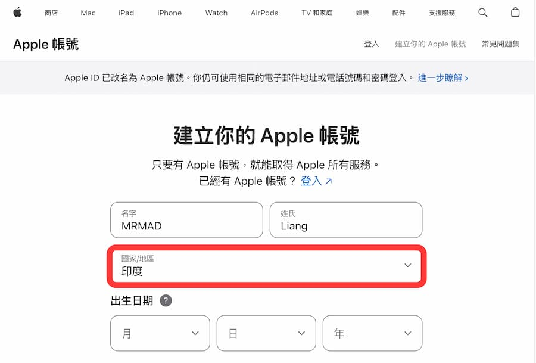
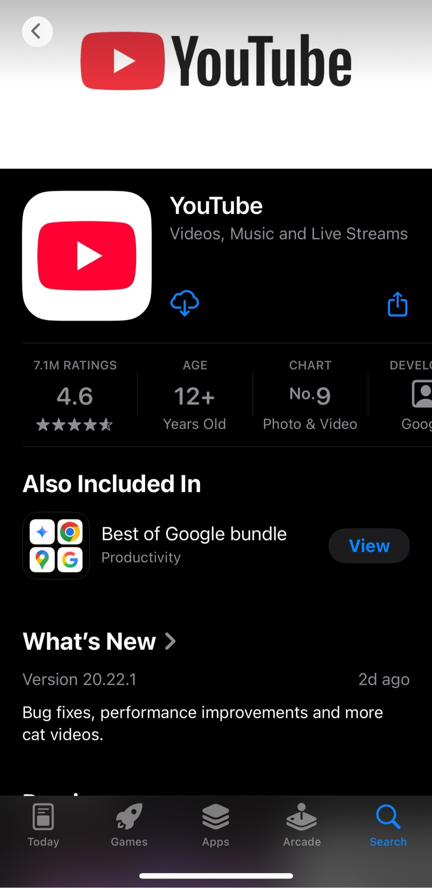
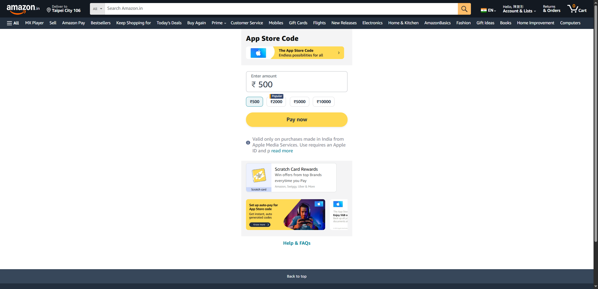
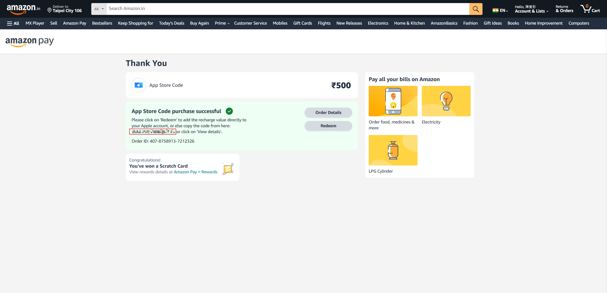
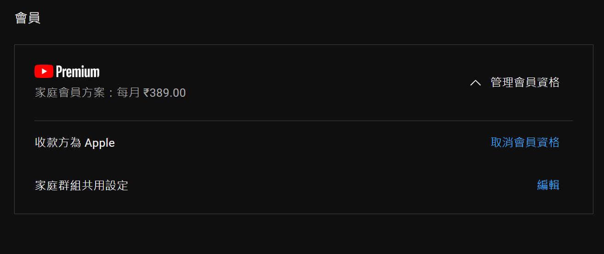
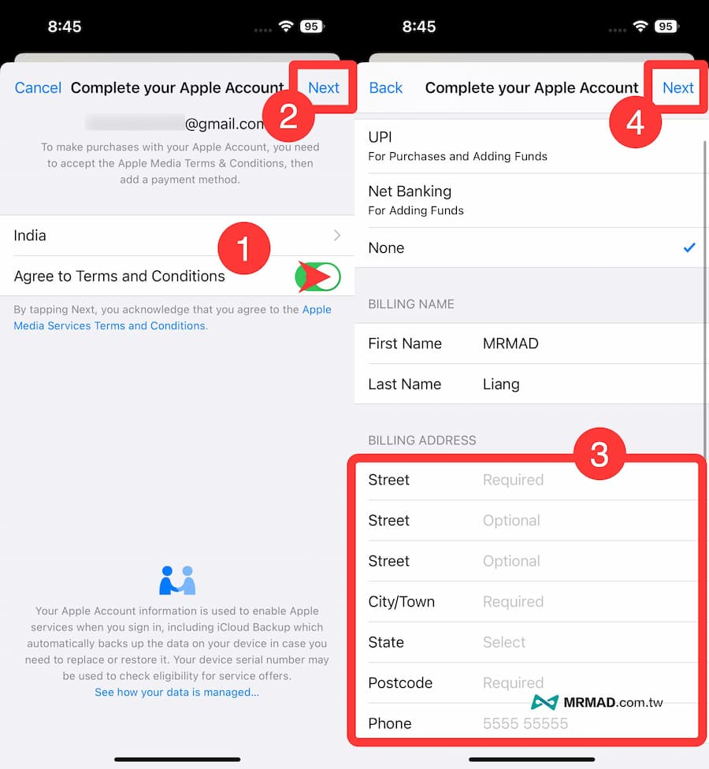
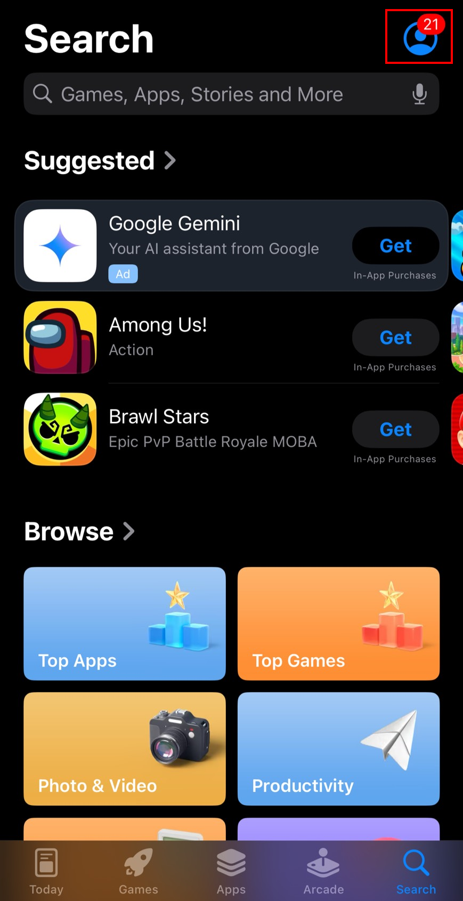
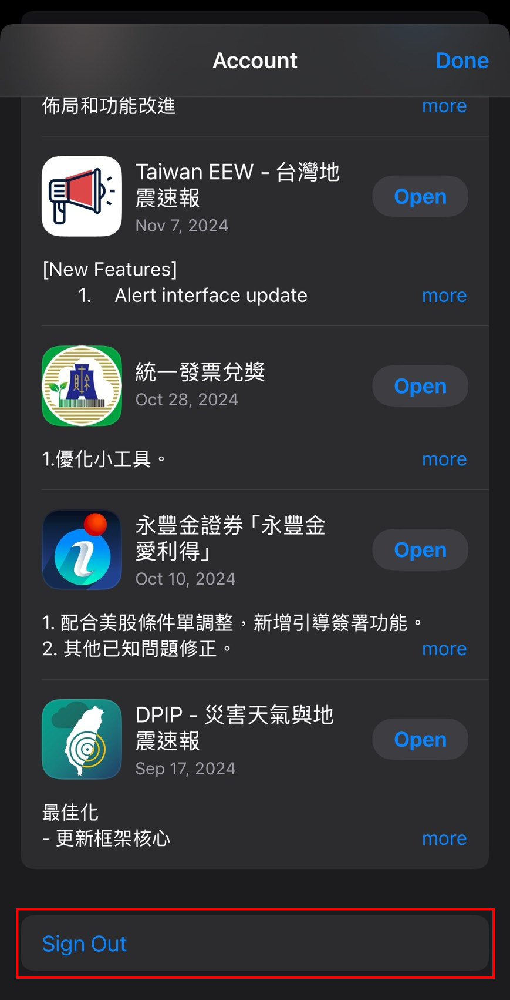

# 如何當個榮譽印度人
### Youtube Premium 跨區教學
<small>2025/06/06 三部三課課會分享</small>

---

## 💰 價格比較 (台灣 vs 印度)

| 方案 | 台灣 (iOS) | 印度 (iOS) |
| :--- | :--- | :--- |
| **個人** | $260 | ≒$68 |
| **家庭** | $630 | ≒$135 |

---

## 01 申辦印度區 Apple ID
* 國家務必選擇 **印度**

 

---

## 02 下載 Youtube
* 刪除舊 App，用印度帳號重新下載

 

---

## 03 打開 Youtube 登入
* 登入原帳號，確認顯示為印度幣值 ₹

 

---

## 04 購買印度禮品卡
* 透過 Amazon.in 購買 App Store Gift Card

---

## 05 複製與準備儲值

---

## 06 App Store 儲值
* 記得儲存在印度的 Apple ID 帳戶

 

---

## 07 回到 Youtube 續訂

---

## 08 成功轉生
* 恭喜成為榮譽印度人！

---

## 📍 必備地址資訊
* **Street**: Parkash Nagar Chowk, Model Town Market
* **Street**: 免填
* **City/Town**: Jalandhar
* **State**: Punjab
* **Postcode**: 144003
* **Phone**: 2231-30147

 

---

## ❓ 常見 QA：如何登出 (1/2)

---

## ❓ 常見 QA：如何登出 (2/2)

---

---

## 🎵 快樂聽音樂

每個月花$479當盤子

每個月花$175當榮譽印度人

---
## 🎉 結論
### 每月省下近 $400，享受 Premium 生活！

